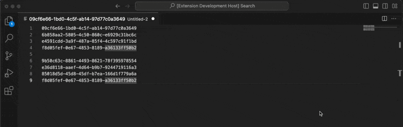

# Regex Dev Tools

Collection of scripts to make things easier.

## Features

All scripts are accesible from the command pallete (CMD + shift + P).

The script assumes that a list of lines is present in the editor to apply the script on them.

### Format to query

> Format the list of ids to query form for log search.

### Format to general array

> Format the list of ids to general javascript array form.

### Format to where array

> Format the list of ids to an array that can be use in log search where based filters.

### Remove duplicates from selection

> Removes duplicate ids from the selection.

### Get differences from selection

> From two lists separated by a blank line it provides in a new list the difference between the two lists, in this case that difference refers to the operation in set theory A-B being A the first list and B the second list, so the result is the list A minus all elements of B that also are in A.
